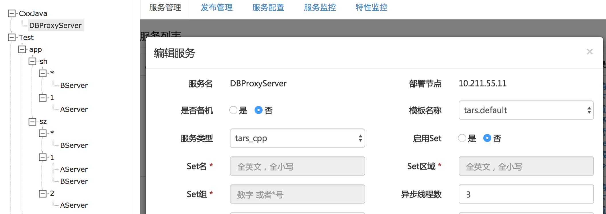
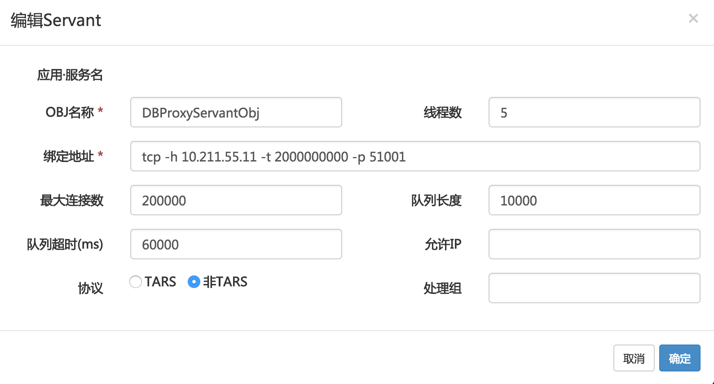
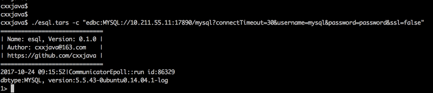

CxxDBProxy:

1. 如何编译：
  1) tars/thirdparty/thirdparty.sh添加并执行：
  git clone https://github.com/cxxjava/CxxJDK.git
  2) 如果没有安装OpenSSL，请编辑thirdparty/CxxJDK/efc/es_config.h#43，注释掉//#define HAVE_OPENSSL
  3) CxxDBProxy工程放置路径：tars/cpp/apps/CxxDBProxy
  4) 开始编译：cd cpp/apps/CxxDBProxy; make clean; make;

  ​

2. 如何部署：
  1) 参考tars文档标准部署CxxJava.DBProxyServer服务:

  

  

  注意服务设置-->绑定地址: tcp -h [your_server_ip] -t 2000000000 -p 50001  #-t值需足够大，默认值会在客户端连接后很快断开，代码参见：
  tc_epoll_server.cpp#1754
  int timeout = _listeners[fd]->getEndpoint().getTimeout()/1000;

  2) 手动复制(或通过服务配置)CxxDBProxy工程下的dbproxy.ini文件到服务目标/usr/local/app/tars/tarsnode/data/CxxJava.DBProxyServer/bin目录下(dbproxy.ini的配置参见https://github.com/cxxjava/CxxDBC项目相关文档说明)；

  3) 手动复制(或通过发布管理)CxxDBC的dblib插件到服务目标/usr/local/app/tars/tarsnode/data/CxxJava.DBProxyServer/bin目录下(插件安装具体参加https://github.com/cxxjava/CxxDBC/)，然后重启服务。

  4) 最终/usr/local/app/tars/tarsnode/data/CxxJava.DBProxyServer/bin目录结构如：

  ```
  CxxJava.DBProxyServer/bin
                       — DBProxyServer
                       — dblib
                            — linux
                               — MSSQL.so
                               — MYSQL.so
                               — ORACLE.so
                               — PGSQL.so
                               — oracle
                                    — libocci.so
                                    — ...
                            — osx
                               -- ...
                            — win
                               -- ...
                       — — dbproxy.ini
                       — — tars_start.sh
  ```


3. 服务验证示例：

  下载https://github.com/cxxjava/CxxDBC/archive/v0.2.0.zip，解开后执行：

  
  ​

4. 由于tars服务框架的限制，目前CxxDBProxy暂不支持以下特性：

  1) 不支持流式数据绑定接口：见client API bindAsciiStream&bindBinaryStream；
  2) 不支持SSL连接；